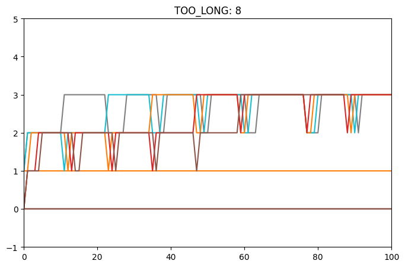
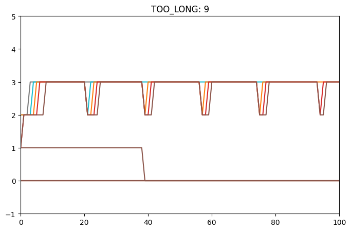
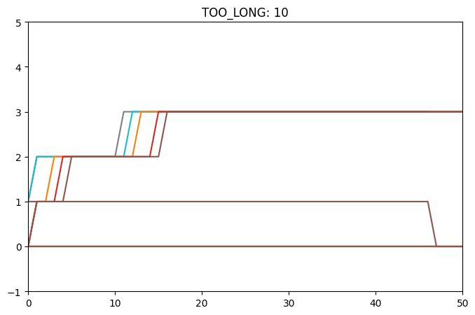
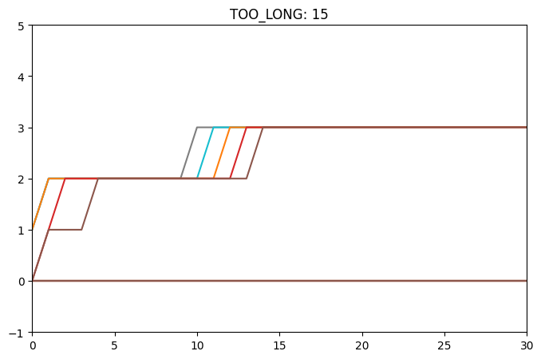

# Table of Contents

1.  [Spec 1](#orgb4e694c)
2.  [Spec 2](#org53f8a2b)
    1.  [FCFS](#org47b9bc6)

# Spec 1

-   `getreadcount()` passes on both tests.
-   works as a syscall using the shell.

# Spec 2

## Implementation

- FCFS
First come first serve.
    - [x] Add pre-processor directives in the Makefile.
    - [x] Changed the `scheduler()` function to include the (relatively) simple algorithm -- it just chooses the process with the minimum creation time using a simple iterative loop.
    - [x] Change `proc.h` to not `yield()` in case there is a trap caused due to the interrupt timer by just putting the yield around an `#IFNDEF FCFS` macro.
    
- MLFQ
Multi level feedback queue.
    - [x] Added new contents to the process struct in `proc.h`.
    - [x] Made sure these were initialized properly on `allocproc()`.
    - [x] Updated the `update_time()` function which basically updates these parameters for every process.
    - [x] Changed the `scheduler()` function yet again.
      - a simple iterative loop which searches for the earliest process in the highest priority queue.
      - added an aging loop which checks if the processes have been waiting for too long.
    - [x] Changed the `trap.c` code to update process parameters if they have taken too much of their own time slice, reducing priority and increasing their ticks.

## Comparison

- FCFS performance
    Average rtime: 14
    wait: 129
- RR performance
    Average rtime 14
    wait 156

- MLFQ experiments
    `TOO_LONG`: waiting time after which process priority upgrades.
    
    <table border="2" cellspacing="0" cellpadding="6" rules="groups" frame="hsides">
    
    
    <colgroup>
    <col  class="org-right" />
    
    <col  class="org-right" />
    
    <col  class="org-right" />
    </colgroup>
    <thead>
    <tr>
    <th scope="col" class="org-right">TOOLONG</th>
    <th scope="col" class="org-right">average rtime</th>
    <th scope="col" class="org-right">wait</th>
    </tr>
    </thead>
    
    <tbody>
    <tr>
    <td class="org-right">30</td>
    <td class="org-right">26</td>
    <td class="org-right">170</td>
    </tr>
    
    
    <tr>
    <td class="org-right">10</td>
    <td class="org-right">14</td>
    <td class="org-right">135</td>
    </tr>
    
    
    <tr>
    <td class="org-right">13</td>
    <td class="org-right">14</td>
    <td class="org-right">135</td>
    </tr>
    
    
    <tr>
    <td class="org-right">20</td>
    <td class="org-right">14</td>
    <td class="org-right">134</td>
    </tr>
    
    
    <tr>
    <td class="org-right">5</td>
    <td class="org-right">14</td>
    <td class="org-right">142</td>
    </tr>
    
    
    <tr>
    <td class="org-right">8</td>
    <td class="org-right">15</td>
    <td class="org-right">144</td>
    </tr>
    
    
    <tr>
    <td class="org-right">30</td>
    <td class="org-right">15</td>
    <td class="org-right">137</td>
    </tr>
    </tbody>
    </table>

# Spec 3 

    

    

    

    
The code used to generate these graphs can be found in [graphs python notebook](./initial-xv6/src/graphs.ipynb).

# Spec 4
1. TCP diff
  - Fixed timeout: TCP uses adaptive timers based on network conditions.
  - I send acks with every request I send back from the recipient to the sender.
  - I'm also not encrypting or hashing my chunks at all, they are being ordered and sent right away. 
  - I'm also waiting for an arbitrary amount of time before I check my ports again to prevent my server from getting ddosses by itself.
2. I've already done that by implementing some kind of sleep timer which waits before sending the request again. Extensions can be: 
   1. a sliding window to manage flow of data
   2. using congestion control algorithms
   3. a dynamic timer as mentioned in the previous answer.
   4. using exponential backoff (increase timer delay) if failures stack up.
